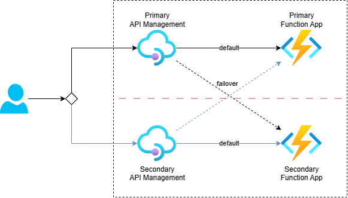

# Failover with Load-Balanced Pool

Sample that shows how to configure a resilient API in Azure API Management (APIM) by using a load-balanced backend pool with two Azure Function Apps in different regions. Each APIM instance is configured to prefer its local Function App and fail over to the other region when needed.

See the following image for a high-level overview:



See the blog post [Implement Failover in API Management with a Load-balanced Pool](https://ronaldbosma.github.io/blog/2026/03/09/implement-failover-in-api-management-with-a-load-balanced-pool/) for a more detailed explanation.

## Prerequisites

Before deploying, make sure you have the following:
- Azure CLI installed and authenticated (`az login`).
- .NET 10 SDK installed (used by `deploy.ps1` to build and publish the Function App project).
- Two Azure API Management (APIM) instances and accompanying Function App resources in different regions.

Expected topology:
- Region 1: Resource Group + APIM + Function App.
- Region 2: Resource Group + APIM + Function App.

You can use the [Azure Integration Services Quickstart](https://github.com/ronaldbosma/azure-integration-services-quickstart) for an easy way to deploy APIM and Function App resources if you don't have them set up yet. Provision the template in two different regions to create the necessary resources.

## Deploy

Use `deploy.ps1` to deploy infrastructure and publish the Function App code.

1. Open a terminal in this folder.
1. Run the script with all required parameters. If you do not pass `-DeployInfra` or `-DeployFunction`, both are executed.

```powershell
./deploy.ps1 `
	-Location "<deployment-location>" `
	-FirstResourceGroupName "<rg-region-1>" `
	-FirstApiManagementServiceName "<apim-region-1>" `
	-FirstFunctionAppName "<func-region-1>" `
	-SecondResourceGroupName "<rg-region-2>" `
	-SecondApiManagementServiceName "<apim-region-2>" `
	-SecondFunctionAppName "<func-region-2>"
```

Optional flags:
- `-DeployInfra`: deploy the API, backends and load-balanced pool from `./infra/main.bicep` to both API Management instances.
- `-DeployFunction`: build/publish Function code from `./src` and zip-deploy it to both Function Apps.

## Test

Use `tests.http` to validate that both APIM instances can reach both Function Apps.

1. Open [tests.http](tests.http) in Visual Studio Code (REST Client extension or another HTTP client).
1. Update request URLs and Function App names.
1. Execute both `POST /resilient-api/` requests.
1. Confirm the response shows that the function app in the same region as the APIM instance is responding, as expected.
1. Change the `respondsWithResultCode` of the function app that is deployed in the same region as APIM to `503` and execute the requests again. The response should come from the other function app, showing that failover is working as expected.

The file includes one request against the primary APIM endpoint and one against the secondary APIM endpoint, so you can verify behavior from both regions.
